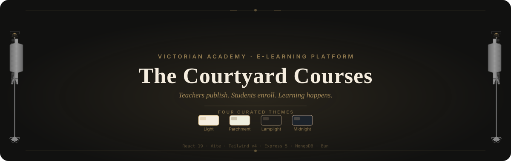

<div align="center">
  

  [](https://react.dev)
  [](https://vite.dev)
  [](https://www.typescriptlang.org)
  [](https://tailwindcss.com)
  [](https://expressjs.com)
  [](https://www.mongodb.com)
  [](https://bun.sh)

</div>

## ⚜ What is this?

**The Courtyard Courses** is a full-stack e-learning platform dressed as a Victorian academy.
Teachers publish courses with chaptered video lessons; students enroll — free or through
Razorpay checkout — and work toward daily reading targets. Between lectures they gather in
course-gated communities, plan their study schedule, and watch their progress charted in a
personal analytics hall.

Everything runs on a hand-tuned design system: Cormorant serif typography, gilded borders,
lamplit courtyards — and **four curated themes** you can switch between from any page.

## Features

| | |
|---|---|
| :books: **Courses** | Chapters & YouTube-hosted lessons, wishlist, reviews, free or paid enrollment via Razorpay |
| :busts_in_silhouette: **Communities** | Create & join gatherings, public or gated by course ownership, per-community messaging permissions |
| :calendar: **Schedule** | Set daily chapter targets per enrolled course and see today's plan at a glance |
| :bar_chart: **Analysis** | Student progress charts and teacher course statistics dashboards |
| :palette: **Theming** | Four hand-tuned palettes — Light, Parchment, Lamplight, Midnight |
| :key: **Roles** | JWT auth with distinct teacher / student experiences |
| :sparkles: **Motion** | Scroll-reveal choreography, animated gates, lamplight glows |

## Themes

Switch anytime from the palette button in the navbar or dashboard sidebar.

| Light | Parchment | Lamplight | Midnight |
|---|---|---|---|
| `#f5eddf` · `#c9a86a` | `#efefdf` · `#8b6b46` | `#1f1e1c` · `#8c7b63` | `#1c232b` · `#a9927d` |

<!-- ─────────────────────────────────────────────────────────────
     GALLERY — drop screenshots into .github/assets/screenshots/
     then uncomment:


────────────────────────────────────────────────────────────── -->

## Tech Stack

| Layer | Tools |
|---|---|
| **Client** | React 19, TypeScript, Vite, Tailwind CSS v4, Redux Toolkit, TanStack Query, Motion, Phosphor Icons, react-hook-form, Sonner |
| **Server** | Express 5, Mongoose 9, JSON Web Tokens, bcrypt, Cloudinary, Razorpay, Multer |
| **Runtime** | Bun (server & scripts) |

## Run It Locally

> Requires [Bun](https://bun.sh) and a MongoDB instance.

```bash
git clone https://github.com/omaku2006/the-courtyard-courses.git
cd the-courtyard-courses
```

**1 — Server** (serves on `http://localhost:3000`)

```bash
cd Server
bun install
cp .env.example .env   # then fill in the values
bun run dev
```

| Environment variable | Purpose |
|---|---|
| `MONGODB` | MongoDB connection string |
| `JWT_SECRET` | Auth token signing secret |
| `CLOUDINARY_URL` | Image uploads (avatars, thumbnails) |
| `YOUTUBE_KEY` | Lesson embeds |
| `RAZORPAY_KEY_ID` / `RAZORPAY_KEY_SECRET` | Paid enrollments |

**2 — Client** (runs on `http://localhost:5173`, proxies `/api` to port 3000)

```bash
cd Client
bun install
bun dev
```

## Project Structure

```
the-courtyard-courses/
├── Client/            # React SPA — pages, components, features, services
│   └── src/
│       ├── components/
│       ├── features/     # redux slices + query hooks per domain
│       ├── pages/
│       └── services/     # axios API layer
└── Server/            # Express API — controllers, models, routes, middleware
```

---

<div align="center">

*Forged within the gilded walls of the Courtyard.*

README hero crafted following the
[beautify-github-readme](https://github.com/oil-oil/beautify-github-readme) methodology.

</div>
